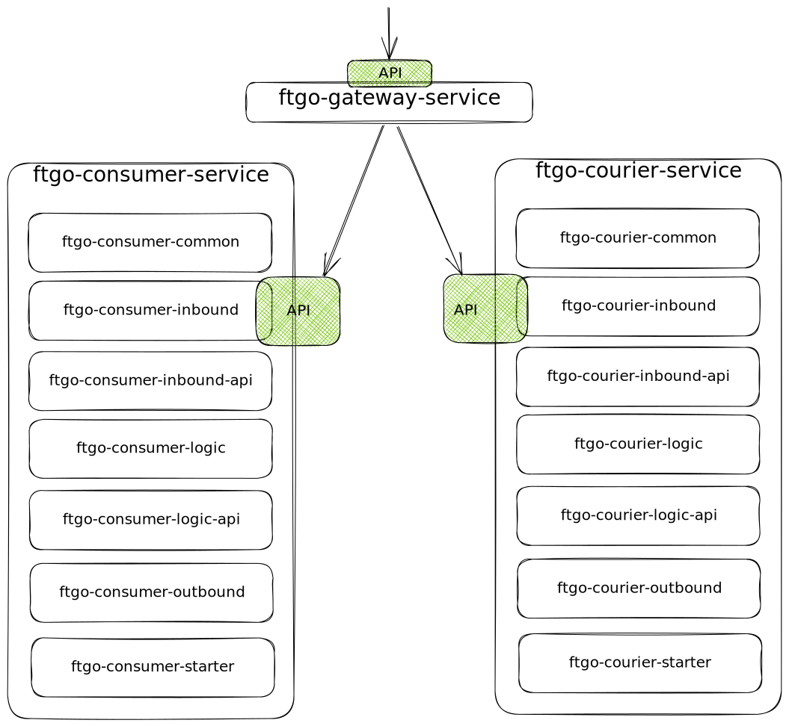

# ftgo-services
This repository contains three microservices which were implemented within the scope of my master thesis.
The purpose is to show the decomposition of a monolithic system into microservices using architecture patterns.

## Architecture

As shown in the graphic above, this repository consists of 3 services:
- **ftgo-gateway-service**: An API-Gateway which forwards HTTP Requests to the other two services.
- **ftgo-consumer-service**: A microservice which handles consumer related business functionality.
- **ftgo-courier-service**: A microservice which handles courier related business functionality.

Both, `ftgo-consumer-service` and `ftgo-courier-service` are implemented with the hexagonal architecture approach. 
Each service consists of the following sub-modules:
- ftgo-`<service-name>`-common
- ftgo-`<service-name>`-inbound
- ftgo-`<service-name>`-inbound-api
- ftgo-`<service-name>`-logic
- ftgo-`<service-name>`-logic-api
- ftgo-`<service-name>`-outbound
- ftgo-`<service-name>`-starter

The entry point of each service (`@SpringBootApplication`-Annotation) is located in the `ftgo-service-name-starter` module.
The business logic is located in `ftgo-service-name-logic`. The main idea of the hexagonal architecture is to separate the
business logic from inbound functionality like http or grpc requests and outbound functionality like database connections or requests to other services).
The business logic exposes both, one inbound interface (`port`) for inbound adapters and one outbound interface (`port`) for outbound adapters.
Modules with an `-api` suffix own contracts (domain classes like `Consumer` in `ftgo-consumer-logic-api` or 
`ConsumerDto` in `ftgo-consumer-inbound-api`) for the corresponding abstraction layer. 

In contrast to the traditional layered architecture, the logic modules are completely independent. They do not dependend on 
inbound or outbound "stuff". 
Allowed dependencies between modules:
- ftgo-`<service-name>`-starter
  - ftgo-`<service-name>`-inbound
    - ftgo-`<service-name>`-inbound-api
    - ftgo-`<service-name>`-logic-api
    - ftgo-`<service-name>`-logic
    - ftgo-`<service-name>`-common
  - ftgo-`<service-name>`-logic
    - ftgo-`<service-name>`-logic-api
    - ftgo-`<service-name>`-common
  - ftgo-`<service-name>`-outbound
    - ftgo-`<service-name>`-logic
    - ftgo-`<service-name>`-logic-api
    - ftgo-`<service-name>`-common

**Consumer Service Example**: That way a new inbound adapter can easily be
added by implementing the [logic inbound interface](./ftgo-consumer-service/ftgo-consumer-logic/src/main/kotlin/ftgo/consumer/logic/inbound/ConsumerService.kt).
In the same way a new outbound adapter (eg. replace the current db) can be 
added by implementing the [logic outbound interface](./ftgo-consumer-service/ftgo-consumer-logic/src/main/kotlin/ftgo/consumer/logic/outbound/ConsumerRepository.kt).

Hexagonal architecture readings: 
- https://medium.com/ssense-tech/hexagonal-architecture-there-are-always-two-sides-to-every-story-bc0780ed7d9c
- https://www.happycoders.eu/software-craftsmanship/hexagonal-architecture/

## Deployment
1. Database: [docker-compose](./_database/ftgo-databases-dev/docker-compose.yaml)
2. Services: [docker-compose](./docker-compose.yml)